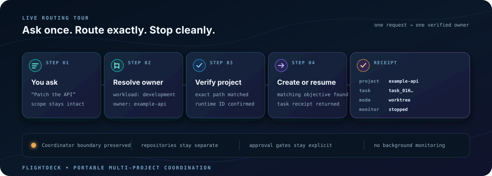

<p align="center">
  
</p>

<h1 align="center">Flightdeck for Codex</h1>

<p align="center">
  <strong>One control plane. Many projects. Exact ownership.</strong>
</p>

<p align="center">
  <a href="#install-in-two-commands"></a>
  <a href="https://github.com/systemsbyzane/flightdeck"></a>
  <a href="CONTRIBUTING.md"></a>
</p>

<p align="center">
  <a href="#install-in-two-commands">Install</a> ·
  <a href="#see-it-route">Live tour</a> ·
  <a href="#choose-your-path">Quick starts</a> ·
  <a href="#safety-and-approvals">Safety</a>
</p>

Flightdeck gives Codex a safe way to coordinate work spread across repositories,
environments, research spaces, and compliance workspaces. It finds the exact
owner, verifies the saved project path, creates or resumes the right task,
returns a receipt, and stops.

Your repositories stay separate. Their instructions, Git history, tests, and
artifacts remain authoritative.

## Install in two commands

Add the public GitHub repository as a Codex marketplace, then install:

```sh
codex plugin marketplace add systemsbyzane/flightdeck
codex plugin add flightdeck@flightdeck-team
```

No clone, build, or installer script is required. Start a fresh Codex task so
the new skills are loaded, then ask:

```text
Set up Flightdeck at /absolute/path/to/my-hub for the Git repositories
under /absolute/path/to/my-repositories.
```

Confirm the plugin is visible with:

```sh
codex plugin list
```

> [!NOTE]
> The target Hub directory must be absent or empty. Setup validates the machine,
> generates atomically, runs local checks, and then attempts to register or open
> that exact path as a Codex project.

## See it route

The animation below is the coordinator contract—not a marketing-only happy
path. Flightdeck resolves ownership, verifies the exact project, creates or
resumes one task, returns the receipt, and does not monitor the child task.



<table>
  <tr>
    <td width="33%">
      <strong>Exact ownership</strong><br>
      Resolve the real owner before reading or changing project code.
    </td>
    <td width="33%">
      <strong>Portable coordination</strong><br>
      Keep reusable policy in the Hub while each repository stays independent.
    </td>
    <td width="33%">
      <strong>Explicit boundaries</strong><br>
      Preserve approval gates for commits, publication, deployment, and closure.
    </td>
  </tr>
</table>

## Choose your path

<details open>
<summary><strong>Create a new Flightdeck</strong></summary>

```text
Set up Flightdeck at /absolute/path/to/my-hub for the Git repositories
under /absolute/path/to/my-repositories.
```

Setup is atomic and non-merging. It generates the Hub, validates it, and
connects existing repositories in place with safe local bridges. Users do not
need to name a skill or edit YAML. If the repository folder is omitted,
Flightdeck finishes core setup and asks one question for it.

</details>

<details>
<summary><strong>Connect existing repositories</strong></summary>

```text
Connect the Git repositories under /absolute/path/to/my-repositories.
```

Flightdeck discovers and previews every repository first, preserves dirty
state, connects safe checkouts in place, adds ignored reference bridges, skips
unmanaged conflicts, and records portable declarations plus ignored local
receipts.

</details>

<details>
<summary><strong>Route real engineering work</strong></summary>

```text
Route this change to its owning project:
add pagination to the example API without changing its response contract.
```

Flightdeck returns the logical project key, opaque runtime project ID, exact
path, task ID, execution mode, and authorization boundary—then stops.

</details>

<details>
<summary><strong>Plan work before changing anything</strong></summary>

```text
Plan the API and deployment changes for this feature. Identify owners,
dependencies, risks, validation, and anything we still need to decide.
```

Flightdeck keeps planning read-only and scales the answer to the work. Small
requests get a compact plan; cross-repository or high-risk requests include
contracts, sequencing, rollout, rollback, and approval gates.

</details>

<details>
<summary><strong>Review a change</strong></summary>

```text
Review this working tree for correctness, security, compatibility, and missing
tests.
```

Flightdeck routes repository review to the exact owner and leads with
evidence-backed findings. It does not fix findings or comment externally unless
the user separately asks.

</details>

<details>
<summary><strong>Diagnose or change CI/CD</strong></summary>

```text
Diagnose why this pipeline is failing. Trace the first causal failure and
separate source fixes from any rerun, release, or deployment action.
```

Flightdeck correlates provider evidence with the workflow at the exact source
revision, routes source changes to the owning repository, and keeps rerun,
publication, promotion, and deployment as separate approval-gated actions.

</details>

<details>
<summary><strong>Coordinate platform work</strong></summary>

```text
Coordinate this platform change across infrastructure source, deployment
configuration, and the target environment.
```

Flightdeck separates declared configuration, generated plans, applied state,
and observed runtime state. Source changes stay with their repository owner;
live validation and mutations stay with the exact environment and authorization
boundary.

</details>

<details>
<summary><strong>Upgrade Flightdeck safely</strong></summary>

```text
Upgrade my Flightdeck plugin without changing my existing Hub or repositories.
Show me what changed before applying anything.
```

Flightdeck compares the installed and marketplace versions, renders recorded
patch notes, protects generated Hubs and attached repositories, and asks before
refreshing or reinstalling anything. It never removes the plugin first or runs
setup against an existing Hub.

</details>

<details>
<summary><strong>Check workspace health</strong></summary>

```text
Use $flightdeck-doctor to run a read-only workspace health check.
```

Doctor reports deterministic findings without fetching, repairing, or
rewriting local state.

</details>

## The 30-second mental model

```text
GitHub plugin
    ↓
setup skill
    ↓
generated Flightdeck Hub
    ↓
verified owning project
    ↓
task receipt → stop
```

- This repository contains the plugin, focused skills, setup tools, and the Hub
  template.
- Setup creates a separate local Flightdeck Hub with routing policy, workflow
  guides, schemas, bridge definitions, and disabled automation specifications.
- Each real repository or program workspace stays a separate Codex project.
- The Hub coordinates ownership and handoff; the owning project performs the
  work.

Flightdeck is a coordinator, not a monorepo and not a background task monitor.

## What gets installed

Installing the plugin makes these focused skills available:

- coordination and exact-project dispatch;
- adaptive, read-only planning and findings-first review;
- CI/CD diagnosis, delivery workflow changes, and release gates;
- platform, infrastructure, and environment coordination;
- setup and Doctor;
- repository bridge planning and installation;
- development, charts, patching, and research workflows;
- Word, PDF, and spreadsheet artifact routing;
- compliance, POA&M, and machine-readable sidecar methods;
- STIG evaluation and deterministic CKL tools;
- safe plugin upgrade planning, preservation verification, and patch notes;
- safe recurring-automation design and review.

The plugin does not install repositories, credentials, scheduled jobs, document
engines, clusters, or a Hub automatically.

The generated Hub contains:

- `AGENTS.md` and `flightdeck.yaml`;
- `bin/flightdeck`, Ruby libraries, schemas, and tests;
- workflow, architecture, security, review, patching, and compliance guides;
- declarative repository and bridge configuration;
- disabled automation specifications;
- synthetic program-workspace templates;
- ignored locations for local task, bridge, report, and project state.

The generated Hub does not contain the plugin, live repositories, credentials,
private evidence, runtime IDs, task history, findings, or deployment state.

## Prerequisites

Required:

- Codex with Git plugin marketplace support;
- Python 3;
- Ruby with its standard JSON, YAML, Open3, and Minitest libraries;
- Git;
- an absent or empty directory for the generated Hub.

Optional:

- an authenticated provider CLI for repository metadata and cloning;
- installed `documents`, `pdf`, and `Spreadsheets` capabilities for Word, PDF,
  and XLSX work;
- separately configured remote Codex projects for runtime validation.

Credentials stay in the user’s existing credential stores. Flightdeck never
puts them in plugin files, Hub configuration, task prompts, receipts, or Git
history.

## Source checkout and setup preview

End users do not need to clone this repository. Contributors and reviewers can
run the source preflight directly:

```sh
git clone https://github.com/systemsbyzane/flightdeck.git
cd /absolute/path/to/flightdeck
python3 plugins/flightdeck/skills/flightdeck-setup/scripts/preflight.py --json
```

For source-only setup before installing the plugin, preview and apply the
repo-managed bootstrap:

```sh
python3 plugins/flightdeck/skills/flightdeck-setup/scripts/bootstrap.py \
  --target /absolute/path/to/my-hub \
  --repositories-root /absolute/path/to/my-repositories

python3 plugins/flightdeck/skills/flightdeck-setup/scripts/bootstrap.py \
  --target /absolute/path/to/my-hub \
  --repositories-root /absolute/path/to/my-repositories \
  --apply
```

Preview is the default. Apply generates only into an absent or empty target,
runs local validation, and revalidates an existing generated Hub without
overwriting managed files. With `--repositories-root`, reruns idempotently
connect newly discovered safe repositories. It never installs the plugin,
registers a project, configures credentials, stages or commits files, adds a
remote, pushes, publishes, or deploys.

## What setup does

`$flightdeck-setup` follows the mandatory
[setup runbook](plugins/flightdeck/skills/flightdeck-setup/references/setup-runbook.md).
It:

1. resolves and validates the exact target path;
2. checks local commands and current Codex capabilities;
3. verifies external document, PDF, and spreadsheet capability gates;
4. copies the bundled Hub template through a staging directory;
5. discovers Git roots only under the user-authorized repository folder;
6. attaches safe repositories in place, creates portable declarations, and
   installs ignored reference bridges without changing tracked repository files;
7. runs Ruby tests, structured parsing, Doctor, link checks, and de-branding;
8. registers or opens the Hub and connected repository projects and verifies
   each by exact path;
9. reports only unresolved blockers without claiming installed-runtime acceptance.

Setup never merges with a non-empty directory, moves an existing checkout, or
invents program, environment, or credential facts.

## How repository bridges work

Opening a nested repository as its own Codex project does not make it inherit
the Hub’s instructions. A bridge tells that repository where the shared
Flightdeck policy lives while preserving the repository’s own `AGENTS.md` as
the authority for layout, commands, tests, and implementation mechanics.

Initial setup automatically installs a `reference` bridge after it verifies:

- the exact repository checkout;
- existing instruction and override files;
- the selected bridge profile and mode;
- local ignore protection;
- the exact saved Codex project path;
- that no tracked repository instructions need to change.

An unmanaged override, bridge drift, credential-bearing origin, detached HEAD,
or path/identity conflict is reported and left untouched. Materialized or
tracked repo-native bridges remain an advanced, separately authorized change.

### Where repositories live

Existing checkouts remain where they already live. Their absolute paths are
stored only in ignored `hub/state/repositories.yaml`; tracked
`hub/repositories.yaml` uses `placement: attached` and contains no
machine-specific path.

Flightdeck also supports intentionally managed checkouts under matching Hub
workload roots:

```text
<hub-root>/
├── development/
│   ├── example-api/
│   └── example-web/
├── charts/
├── patching/
└── compliance/
```

Lower-level provider onboarding can still clone a deliberately managed
checkout when explicitly requested. Ordinary one-prompt setup does not clone.

Discovery creates a portable attached declaration like this:

```yaml
api_version: flightdeck.dev/v1alpha1
kind: RepositoryDeclarations
schema: hub/schemas/repository-declarations.schema.json
repositories:
  - id: example-service
    placement: attached
    workload: development
    provider: github
    locator: example-company/example-service
    owner: example-company
    default_branch: main
    default_branch_verified: true
    bridge:
      profile: application
      mode: reference
    codex_project:
      expectation: saved_exact_path
      logical_key: example-service
```

Manual declaration editing remains an advanced option. Managed declarations
use `placement: managed` and a Hub-relative `local_path`. Advanced mode changes,
migration, or drift repair route to the mandatory
[bridge configuration runbook](plugins/flightdeck/skills/flightdeck-repo-bridge/references/configure-bridge-repos.md).
It plans every repository before applying anything, preserves dirty state,
refuses unmanaged or drifting targets, verifies exact project paths, records
ignored receipts, and creates no implementation task.

Bridge modes are:

- `reference`: a machine-local ignored override points to Hub documents;
- `materialized`: an ignored, versioned local policy pack is copied into the
  repository;
- `repo-native`: minimum portable policy is added to tracked repository
  instructions, only with explicit per-repository authorization.

## How dispatch works

For project-owned work, Flightdeck:

1. reads Hub policy, registry, routing, bridge state, and live project metadata;
2. resolves the logical owner without inspecting the owner’s code or artifacts;
3. verifies or safely onboards the checkout;
4. refreshes the live project list and matches the exact normalized real path;
5. keeps the stable logical key separate from the returned opaque runtime ID;
6. verifies the bridge handoff and instruction order;
7. searches recent tasks and resumes a matching objective or creates one;
8. returns project key, runtime project ID, task ID, mode, and authorization
   boundary;
9. stops without reading, polling, waiting for, or monitoring the child task.

The child reads its active repository `AGENTS.md` first and the verified Hub
bridge second. Local mode is the default for read-only or intentional
current-checkout work. Worktree mode is the default for isolated repository
implementation. A matching remote project is used only for runtime validation
that genuinely belongs there.

## Common prompts and expected routing

| Prompt | Expected route |
|---|---|
| `Run a read-only workspace health check.` | Hub Doctor; no remediation |
| `Configure bridge repos.` | Bridge runbook; no implementation task |
| `Add this API behavior in the example service.` | Owning repository task, normally Worktree mode |
| `Patch the fixable image findings without changing runtime contracts.` | Owning image or consumer repository via patching workflow |
| `Review this Helm change and render the manifests.` | Owning chart repository via charts workflow |
| `Research declared versus deployed configuration.` | Read-only owner or runtime project with a source ledger |
| `Prepare a Word policy from approved Markdown.` | Program workspace plus documents capability and visual QA |
| `Generate POA&M candidates from these supported weaknesses.` | Isolated compliance program workspace with JSON/YAML sidecars |
| `Evaluate this CKL without changing a cluster.` | Adaptive STIG workflow with read-only evidence |
| `Review these STIG findings for evidence gaps and export readiness.` | Draft-friendly validation with strict final provenance |
| `Create a weekly vulnerability review.` | Disabled automation specification until separately enabled |

## Safety and approvals

Read-only planning and diagnostics do not authorize mutation. Explicit user
approval remains required for:

- commits, pushes, pull requests, comments, and repository publication;
- deployment or shared-environment mutation;
- external communication;
- enabling or changing real scheduled automations;
- compliance submission;
- risk acceptance;
- control, finding, or POA&M closure claims.

Flightdeck preserves dirty and untracked user state. It does not clean, reset,
stash, force-push, overwrite unmanaged instruction files, expose sensitive
evidence, or treat client-side authorization as an enforcement boundary.

## Generated-Hub navigation

Start with the generated Hub’s `README.md`, then:

- `docs/README.md` for the complete guide map;
- `docs/codex-ui-workflow.md` for the project/task mental model;
- `docs/workflows/thread-routing.md` for owner and mode selection;
- `docs/workflows/configure-bridge-repos.md` for repository onboarding;
- `docs/architecture/control-plane.md` for routing and state design;
- `docs/security/` and `docs/review/` before review-ready claims;
- `docs/patching/` for image and dependency compatibility;
- `docs/compliance/` for RMF, ATO, POA&M, evidence, policy, and sidecars;
- `hub/automations/README.md` for the specification-versus-real-schedule
  boundary.

Contributor parity and release contracts live in
[process parity](docs/process-parity.md),
[functional parity](docs/functional-parity.md), and
[release readiness](docs/release-readiness.md).

## Updating

Ask Flightdeck to inspect the installed version, show the patch notes, and
prepare a preservation-aware upgrade plan:

```text
Upgrade my Flightdeck plugin without changing my existing Hub or repositories.
Show me what changed before applying anything.
```

Patch-note and preflight checks are read-only. Flightdeck asks for explicit
approval before refreshing a Git marketplace or reinstalling the plugin, then
uses the supported `codex plugin add flightdeck@flightdeck-team --json` path
without an uninstall step. Start a fresh Codex task afterward so the new skill
definitions load.

Plugin upgrade does not run setup, modify attached repositories, or migrate an
existing generated Hub. The setup generator has no merge or overwrite mode.
Any future Hub-template migration is a separate, explicit plan-and-diff
workflow. See the
[upgrade contract](plugins/flightdeck/skills/flightdeck-upgrade/references/upgrade-contract.md)
and the machine-readable [release ledger](plugins/flightdeck/releases.json).

## Uninstalling

Remove the plugin:

```sh
codex plugin remove flightdeck@flightdeck-team
```

If the marketplace is no longer needed:

```sh
codex plugin marketplace remove flightdeck-team
```

Uninstalling the plugin does not delete generated Hubs, repositories, ignored
local state, program workspaces, or artifacts. Remove those separately only
after reviewing their contents and backups.

## Troubleshooting

- `target must be absent or empty`: choose a new directory; setup never merges.
- Missing `python3`, `ruby`, or `git`: install the named prerequisite and rerun
  preflight.
- Missing Word, PDF, or spreadsheet capability: core setup may continue, but
  that artifact workflow remains blocked until the capability is installed.
- Marketplace name or source conflict: inspect
  `codex plugin marketplace list`; do not replace a marketplace that points
  elsewhere until the conflict is understood.
- Project path not verified: use the one manual open-folder action returned
  after the supported registration path has been retried.
- Existing override or bridge target: inspect ownership; Flightdeck will not
  overwrite it.
- Bridge drift: compare recorded and current digests and use a separately
  reviewed migration.
- `doctor` reports `ok: false`: findings were detected; the command itself may
  still have run correctly.
- Ahead/behind counts look stale: Doctor does not fetch and uses existing local
  tracking refs.
- A task was dispatched but no result appeared in the Hub: expected behavior;
  Flightdeck stops after the receipt. Open the owning task or ask later to
  consolidate it.

## Contributor validation

Read [AGENTS.md](AGENTS.md) before changing the plugin. The repository
`Makefile` exposes a self-contained `make validate` suite and a source-backed
release suite. For the required full comparison against a read-only reference
Hub, run:

```sh
make release-validate \
  SOURCE_HUB=/absolute/path/to/read-only-reference-hub \
  PRIVATE_NEUTRALIZATION_MAP=.flightdeck-local/private-neutralization.json
```

The release target validates the plugin and all skills, parses structured
files, runs Ruby and Python tests, generates and validates a fresh synthetic
Hub, checks links and de-branding, runs the local acceptance harness, and
executes strict source inventory plus semantic parity. Optional
`SOURCE_HUB_SKILL` and `SOURCE_STIG_SKILL` paths add active-skill comparisons.
The private-neutralization map is a required ignored local input for
source-backed validation. It supplies source-only vocabulary at runtime and
must never be committed, packaged, installed, or copied into generated Hubs.

Installed-plugin project registration and real task create/resume behavior are
fresh-task runtime acceptance checks. Local tests cannot satisfy them, and this
repository must not claim otherwise.
